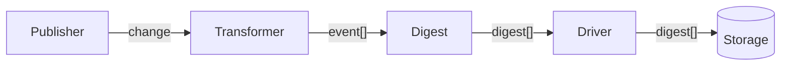
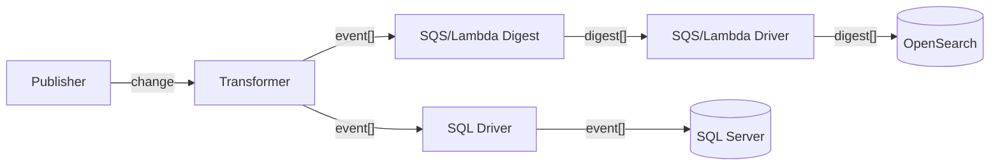
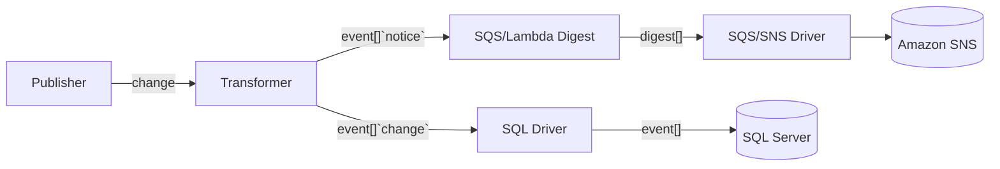

# 📚 Auditor

Provides components for pipelining auditable events including:

- Field-level changes on data models
- User actions in applications
- User access level changes
- Metrics of user behaviour
- Metrics of performance for web applications
- Any custom events


# Architecture

## Event Pipeline

JSON objects are generated within applications and passed through a pipeline of middleware before ultimately being stored:



* **Publisher** is the application code that generates a `change` to track. Some examples include:
  * Data model changes: field value changes from `foo` to `bar`
  * Stateful changes: form submission goes from `unsubmitted` to `submitted`
  * Access control changes: User `mcmanning.1` has been granted `write` access
* **Transformer** takes your change along with a set of **Event Rules** and converts it to one or more `events` as **Event Objects**.
* **Digest** is an *optional* step to combine incoming events based on event rules and the contents of each event into **Digest Objects**.
* **Driver** converts and streams the new events and digests into storage.
* **Storage** is responsible for persisting events for the duration of your retention policy or perform some sort of external action using that event. 

The pipeline may be adjusted to a less linear setup. For example, an application may require digests to be sent to OpenSearch for the short term and a copy of raw events to be stored in SQL Server for long term retention:



Another common use case may be to pipeline model changes to long term storage and user-facing notifications over to a messaging system like Amazon SNS. The transformer can filter messages based on **Tags** into specific streams:



Tagging will often be used to ensure restricted data remains within the DMZ while still allowing certain events to utilize cloud services.


## Event Object

An event is a structured JSON blob containing the What, When, Where, Who, and Why.

```json
{
  // Enumerable event type. This defines the requirements
  // on the contents of the `fields` payloads.
  "event": "update",

  // ISO-8601 of the event
  "date": "2022-12-15T20:54:49+0000",

  // Tags used for routing events to different drivers
  "tags": [
    "notify",
    "security",
  ],

  // A Resource Reference atomic representing
  // where the event has occurred
  "resource": {
    "id": " 123abc...",
    "name": "2023X0014 - A Study of Scarlet and Grey",
    "category1": "IRB",
    "category2": "Amendment",
    "category3": ""
  },

  // A Person atomic representing the 
  // individual that caused the event.
  // This may be omitted for automated events
  // that have no independent actor. 
  "actor": {
    "id": "012346789",
    "name": "Chase",
  },

  "fields": {
    // An object with details of the event. The structure is 
    // standardized across different types of built-in events.
  },
}
```

## Digest Object

A digest represents event objects that can be combined into a single JSON object. 

Examples of digests would include:
- Multiple field-level changes on the same model by the same user within a short time period
- A reviewer receiving multiple form submissions to review

Structurally, it's the same as an event object but with the following changes applied:

```json
{
  // ... all event object fields ...

  // Date of the earliest event digested
  "startDate": "2022-12-15T20:54:49+0000",

  // Number of events digested
  "count": 2,

  // The UNION of fields from all digested events.
  // You may configure the digest middleware to *exclude*
  // certain events when the number of events digested
  // exceed some threshold (e.g. 1000 events)
  "fields": [
    {
      // event[0].fields...
    }, { 
      // event[1].fields...
    }
  ]
}
```


## Event Rules

⚠ The below is a VERY rough draft and subject to change.

Event rules are associated with every event after the transformation step and are specified by the Publisher. 

```json
{
  // Should the referenced resource be updated with changes?
  // e.g. automated OpenSearch resource updates as part of 
  // the change - but that might make more sense as its own driver
  // This should be false for applications that are responsible
  // for updating their own resources on change.
  "sync": true,

  // Is the event allowed to be digested. Multiple types of 
  // messages may pass through the same pipeline (SQS -> Digest -> OpenSearch)
  // but we want to ensure that certain important events don't 
  // get converted to digests, otherwise we may lose metadata.
  "digest": true,
  
  // Window of time to digest similar messages. E.g. "same" messages
  // within a 5 minute window will become a single digest
  "digestWindow": "5m",

  // Maximum number of digested event fields to include on a digest.
  // Anything more will be omitted from the payload. This helps us
  // integrate with services like SQS that have a payload limit.
  "digestFieldsLimit": 100,
}
```

A *rough* PHP example could look like:

```php
$audit = new OSUResearch\Auditor();

// ... transform/driver streams setup code ...
// Defaults for rules could also be set per-stream/driver.

$audit->log(
  $actor = $employee,
  $resource = $form,
  $event = 'approve',
  $rules = [
    'digest' => false,
  ]
);
```

# Pre-defined Event Types

Out of the box we define a set of standard events that are typical across most of our applications. APIs exposed by this project will provide utilities for making it easier to manage these event types.

## Create

Track the creation of a new resource. Could be a form, a task, an email, etc. This is typically useful when creation is followed up by additional events on the same resource.

* `fields` defines a mapping of JSONPath attribute names to atomics for the newly created resource.
* `create` events cannot be digested together.

For example, if we create a priority issue for a support group:

```json
{
  "fields": {
    "group": "IT Support",
    "contact.name": "Chase",
    "contact.email": "thechase@osu.edu",
    "priority": "high",
    "title": "kyboard",
  }
}
```


## Update

Update one or more fields on an existing resource.

* `fields` defines a mapping of JSONPath attribute names to a tuple of atomics representing the old and new value.
* `update` events can be digested together for the same `actor` + `resource`. If the same field attribute name exists between events, the tuple of atomics will combine the *earliest* event's old value and the *latest* event's new value.

For Create's ticket example, a user could modify their ticket content and trigger an `update`:

```json
{
  "fields": {
    "title": ["kyboard" "kb button bug"],
    "description": [null, "Th kyboard ky btwn w and r wont work. PLASE HLP"]
  }
}
```

If a second event is digested to update the title again, the resulting `fields` will look like:

```json
{
  "fields": {
    "title": ["kyboard" "kb button bug!!!!!"],
    "description": [null, "Th kyboard ky btwn w and r wont work. PLASE HLP"]
  }
}
```

## Delete

Delete an existing resource.

* `fields` defines a mapping of JSONPath attribute names to atomics that were modified as part of the deletion (such as deletion date, deletion state, deletion reason, etc)
* `delete` events cannot be digested together.


# Requirements

Notes around requirements in depth. Will be cleaned up.

## Design Goals

We want a predefined set of standard audit types and data structures such as field-level modification in a model, access control changes, error metrics, etc such that we can provide a simple plug-n-play for our suite of applications.

Technology-wise, this should support:
- Fully serverless applications on AWS
- Fully on-site PHP applications that adhere to strict security policies
- Frontend state changes / errors / interactions in React

Data generated by auditor should integrate smoothly with the Search Tools and Atomics projects.

Expected use cases include:
- Change tracking on form revisions
- Action logging on research protocols
- Data feeds into visual dashboards for stakeholder decision making
- Audit reporting for stakeholder access review


## Publishers

- Monitor and track model changes 
  - e.g. user modifies a field of a form, pull the old and new values of that field and create an event for a transformer
- Allow custom events to be fired
  - e.g. application wants to track when forms are submitted, reviewed, documents approved, etc.
  - Event names must not conflict with reserved event names (CRUD ops, some other audit ops that I haven't though of yet, etc)

## Transformers

- Converts input data into one or more events based on the input criteria
- Exposes the APIs for built-in events (create, update, delete, etc)
- Can have multiple outputs as either drivers or digests (or more transformers?)
- For PHP, Monolog is the go-to for multi-driver log feeds and we can most likely leverage that
- Laravel Auditor is also something we leverage for wiring in Eloquent events as automatic pipelines
- For Node, what's the equivalent?

## Digests

- SQS + Lambda function that runs on a fixed time step (say every 5 minutes)
- Reads everything off the queue since the last run
- Combine queued events that match into a single event. 
  - Match being: same user, same resource, same sequential event type. 
  - e.g. can digest `update -> update -> submit` into just `update -> submit`
  - But you can't digest `update -> submit -> update` into `update -> submit`. 
  - If the timing between events is too far, don't batch. Say we skipped one of the 5 minute runs, we need to make sure that it still digests ~5 minutes per event rather than the 10 minutes since we last ran.
- Queue should digest by some fixed time step, e.g. every 5 minutes. Which means run a job every 5 minutes to read everything off the queue, batch it, and send it to the driver.


## Drivers

- Think SQS, Lambda functions, Laravel Auditor
- Multiple drivers can be attached to the same pipeline 
  - e.g. feed the same event into both OpenSearch and SQL storage

## Storages

- Think OpenSearch, SQL Server, S3, Splunk, etc.
- Data retention policies? Provide guidance per service? Or just leave it up to the org?
- Search/filtering support? (I think that would be implied by the platform)


# Questions / Misc Notes

* People data / data that changes over time (protocol titles)?
  * This is an AUDIT trail so storing the data as it was at the time of audit is the better route. I don't want anyone to be able to modify anything within an audit in bulk or anything like that. Since IDs need to be fixed, we can always replace the "name" with a value from another data source during display if needed. 
* ~~Audit combinations?~~ Yes! Added digest as a feature
  * E.g. if we queue up a bunch of `update` audit events for the same resource, can we combine them into a single audit record to save us some space? I'd say yes as long as they're grouped by resource + actor within some window.
  * Process could look like upload individuals to SQS, wait ~5 minutes or whatever before processing, process everything pending on SQS and group like audit records together before sending to OpenSearch.
* Is there an equivalent to Laravel Auditor in NodeJS that we can use for serverless code?
* Direct to user notifications? 
  * I'd probably say the target `resource` could potentially be a person atomic as well, that way someone can subscribe in SNS using their atomic. It'd make sense since I'm also aiming to index people as resources for Search Tools support.
  * This would also fit the pattern of them being able to subscribe to notifications for various other resources, like protocols, submissions, etc.

